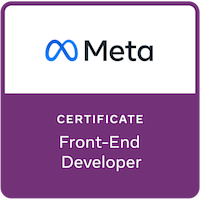
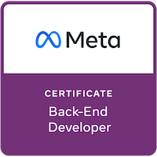
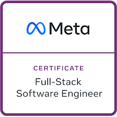

Full-Stack software engineer with experience in developing web applications. I have worked on various projects for clients as well as created personal projects, ranging from full e-commerce platforms to RESTful APIs. I am proficient in <strong>HTML</strong>, <strong>CSS</strong>, <strong>JavaScript</strong>, <strong>React JS</strong>, <strong>Python</strong>, <strong>Django</strong>, <strong>DRF (Django REST Framework)</strong>, <strong>SQL</strong> and other technologies. I am very enthusiastic about creating user-friendly and scalable solutions that meet the needs and expectations of my clients. I am always eager to learn new skills and explore new challenges in the field of software engineering.

<h2><strong>🎓 Education</strong></h2>
<table>
    <thead>
        <tr>
            <th></th>
            <th width="600"></th>
        </tr>
    </thead>
    <tbody>
        <tr>
            <td></td>
            <td>
                <strong>Bachelor of Science (BS), Electronics</strong> 
                <strong>University of Karachi, Pakistan</strong> 
                <em>January 2019 - January 2023</em>
            </td>
        </tr>
    </tbody>
<table>

<h2><strong>🧑‍💻 Tools and Technologies</strong></h2>

**`HTML5`, `CSS3`, `JavaScript`, `Python`, `Java (Core Language)`, `React`, `Django Web Framework`, `Django REST Framework`, `RESTful APIs`, `Pytest`, `Databases`, `SQL`, `PostgreSQL`, `Docker`**

<h2><strong>🏅 Badges</strong></h2>
<table>
    <thead>
        <tr>
            <th width="500px">Meta Front-End Developer</th>
            <th width="500px">Meta Back-End Developer</th>
            <th width="500px">Meta Full-Stack Software Engineer</th>
        </tr>
    </thead>
    <tbody>
        <tr>
            <td align="center"></td>
            <td align="center"></td>
            <td align="center"></td>
        </tr>
    </tbody>
</table>

## **📜 Certifications**

<table>
    <tbody>
        <tr>
            <td></td>
            <td></td>
            <td></td>
            <td></td>
        <tr>
    </tbody>
</table>

<!---
- 👋 Hi, I’m @kumailalidev
- 👀 I’m interested in ...
- 🌱 I’m currently learning ...
- 💞️ I’m looking to collaborate on ...
- 📫 How to reach me ...
--->

<!---
kumailalidev/kumailalidev is a ✨ special ✨ repository because its `README.md` (this file) appears on your GitHub profile.
You can click the Preview link to take a look at your changes.
--->
